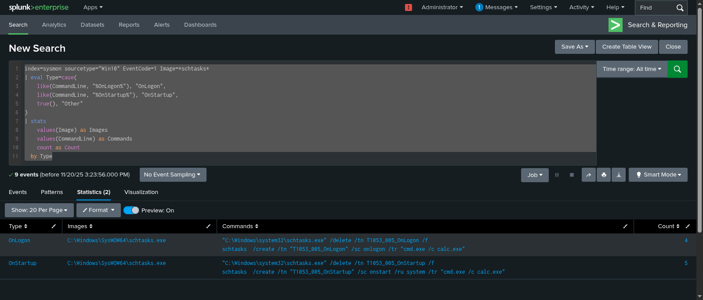

# Attack Execution: T1053.005

##  Prerequisites
- **Atomic Red Team** installed on the victim machine.
- **PowerShell** running as Administrator.

##  Execution Steps

### 1. Scheduled Task via cmd
This test creates a scheduled task named "AtomicTask" that spawns a command prompt.

**Command:**
```powershell
Invoke-AtomicTest T1053.005 -TestNumbers 1
```

**What happens:**
1.  `schtasks.exe` is executed.
2.  A new task "AtomicTask" is registered.
3.  The task is set to run a command (often `echo` or `calc.exe` for testing).

**Verification:**
SPL for splunk :
```cmd
index=sysmon sourcetype="Win10" EventCode=1 Image=*schtasks*
| eval Type=case(
    like(CommandLine, "%OnLogon%"), "OnLogon",
    like(CommandLine, "%OnStartup%"), "OnStartup",
    true(), "Other"
)
| stats 
    values(Image) as Images
    values(CommandLine) as Commands
    count as Count
  by Type
```
**Results**



### 2. Cleanup
After running the test, remove the artifact.

**Command:**
```powershell
Invoke-AtomicTest T1053.005 -TestNumbers 1 -Cleanup
```