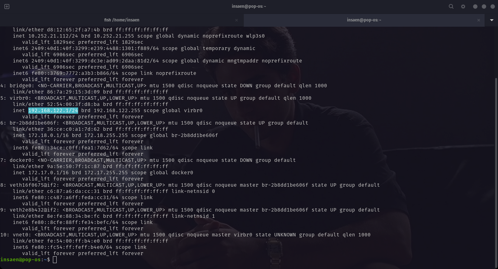
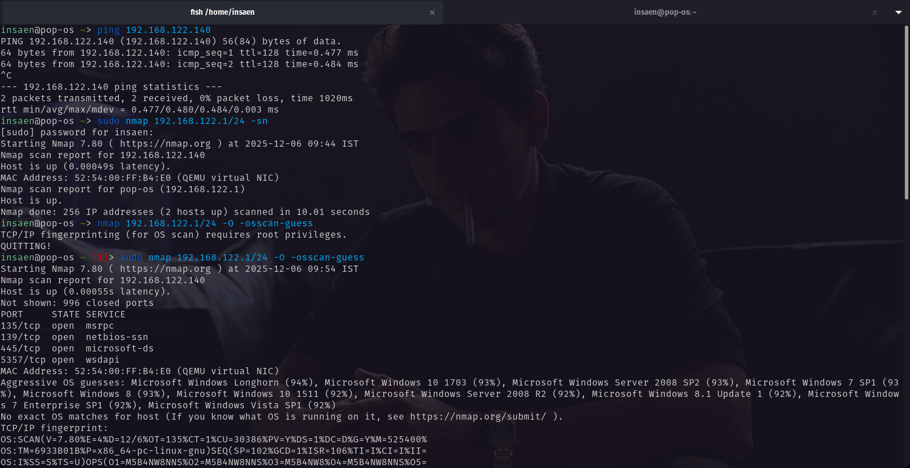
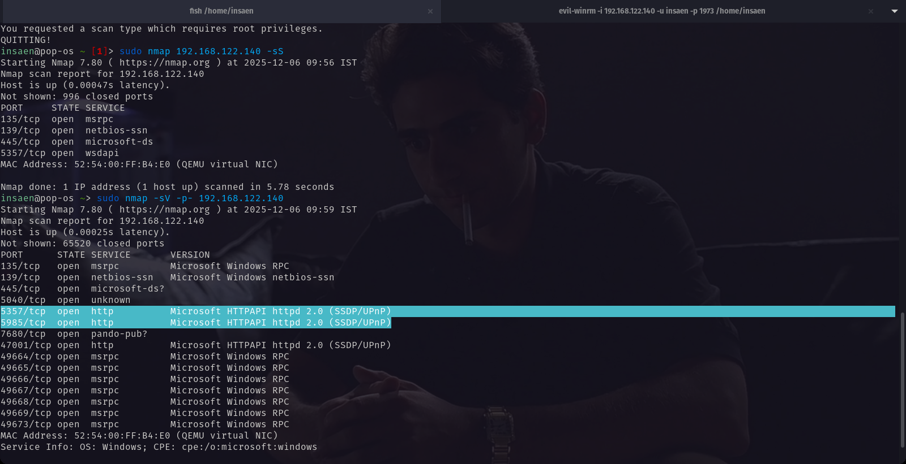

## Setup and Reconnaissance

### Environment Overview

*   **Attacker:** Pop!_OS (Linux)
*   **Target:** Windows 10
*   **Hypervisor:** virt-manager (QEMU/KVM)
*   **Network Mode:** NAT (Windows VM visible only to Pop!_OS)

### Network Overview

```text
External Network / Internet
    └── Pop!_OS (Attacker)
          └── Virtual NAT Network (192.168.122.0/24)
                └── Windows 10 (Victim)
```

*   Pop!_OS has two network interfaces: a physical one (Wi-Fi/Ethernet) and a virtual bridge (`virbr0`) created by KVM/QEMU.

## Reconnaissance

**Commands used:**

```shell
# I'm using NAT connection in my VM WIN10 (virbr0)
ip a 
```



## Scanning & Enumeration

```shell
## Host detection, OS detection, Port Scanning 
nmap 192.168.122.0/24
nmap 192.168.122.140 -O -osscan-guess
# to scan all ports as port 5985 does not comes under top 1000 ports
nmap 192.168.122.140 -sV -p- 
```




### Conclusion

*   **Port 5985 (HTTP)** is open, indicating the Windows Remote Management (WinRM) service is active. This is a common target for lateral movement.
* WinRM allows remote PowerShell execution. If authentication is weak, attackers can get full interactive shell access.
