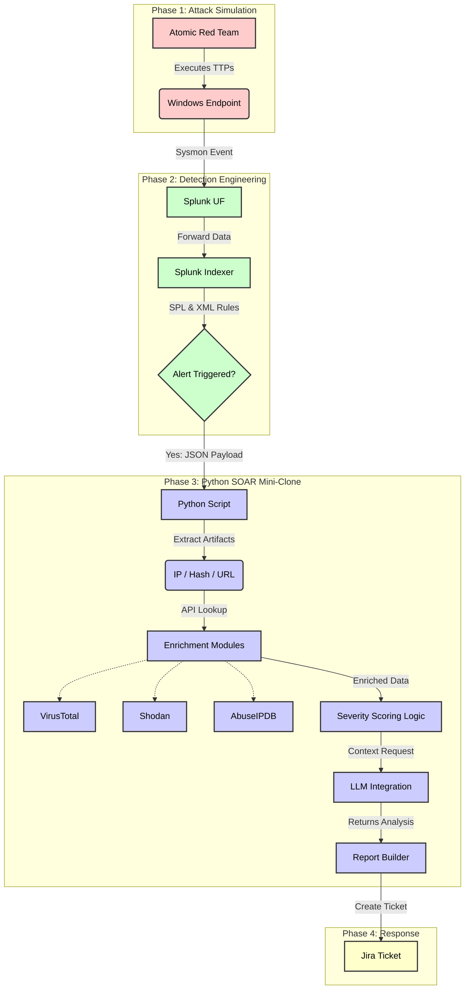

# Windows Endpoint Telemetry & SOAR Automation

Windows Endpoint Telemetry System using Sysmon + Splunk Indexer + UF + Generating Alerts + SPL Queries + Dashboards + Atomic Red Team Attacks + Writing Sysmon XML Rules + Python SOAR Mini-Clone.

## Project Workflow



```Mermaid
graph TD
    A[Windows 10 Endpoint] -->|Sysmon Events| B[Splunk Universal Forwarder]
    B -->|Forwards Logs| C[Splunk Indexer]
    C -->|Search + Validate| D[Initial SPL Queries / Dashboards]
```
## System Architecture & Components

### 1. Telemetry & Detection (Sysmon + Splunk)
The foundation of the project is robust telemetry and detection.
*   **Sysmon**: Configured with custom XML rules to capture relevant endpoint telemetry.
    *   [Installation Guide](Window/Sysmon/Insatallion.md)
*   **Splunk**: Acts as the SIEM, ingesting logs via Universal Forwarder (UF), running SPL queries, and hosting dashboards.
    *   [Windows UF Installation](Window/SplunkUF/Installtion.md)
    *   [Linux Custom Alert](Linux/Splunk/customAlert.md)

### 2. Python SOAR Mini-Clone
A custom automation pipeline that processes alerts triggered by Splunk.

**Pipeline Steps:**
1.  **Ingest**: Receives the Alert JSON payload from Splunk.
2.  **Extraction**: Parses the payload to extract artifacts (IPs, Hashes, URLs).
3.  **Enrichment**: Queries external APIs (VirusTotal, Shodan, AbuseIPDB) for reputation data.
4.  **Scoring**: Calculates a severity score based on enrichment data.
5.  **AI Analysis**: Queries an LLM to format the analysis, map to MITRE ATT&CK, and suggest response actions.
    *   *Note: AI is used primarily for formatting and structure, as it may not be reliable for critical risk assessment.*
6.  **Response**: Automatically creates a Jira ticket with all gathered context.

**Scripts:**
- [Alert Script](MINI-SOAR-PY/alert_script.py) - Main controller for the SOAR pipeline.
- [LLM Integration](MINI-SOAR-PY/llm.py) - Module for AI-based formatting and mapping.

### 3. Attack Simulation (Atomic Red Team)
Simulated attacks used to test and validate the detection pipeline.

#### T1003.001 (OS Credential Dumping)
- [Analysis](AtomicRedteam/T1003.001-Playbook/Analysis.md)
- [Attack Execution](AtomicRedteam/T1003.001-Playbook/Attack-Execution.md)

#### T1053.005 (Scheduled Task)
- [Analysis](AtomicRedteam/T1053.005-Playbook/Analysis.md)
- [Attack Execution](AtomicRedteam/T1053.005-Playbook/Attack-Execution.md)

#### T1059 (Command and Scripting Interpreter)
- [Guide](AtomicRedteam/T1059-Playbook/Guide.md)

### 4. Integration Guides
- [Jira Python Connection](Jira/Python_Connection.md)
- [Jira Setup](Jira/Setup_Guide.md)