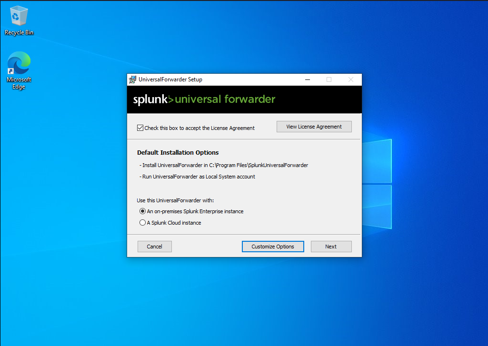
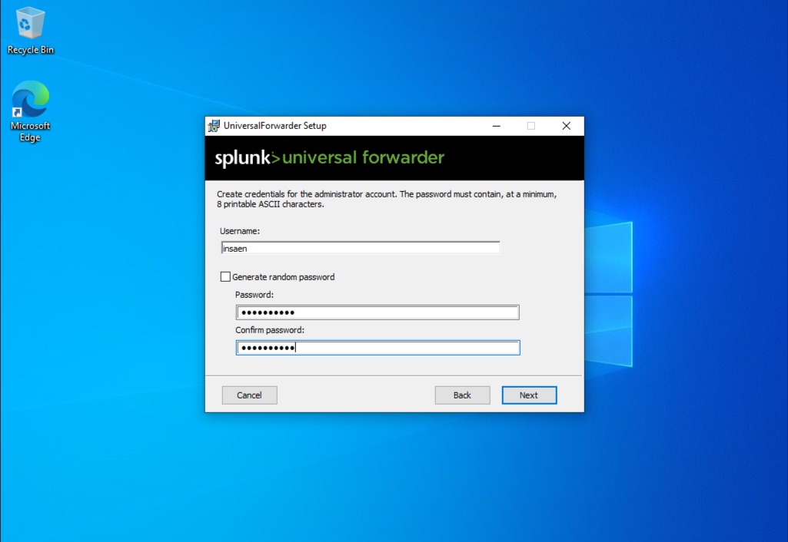

#  Splunk Universal Forwarder Installation and Configuration Guide

The **Splunk Universal Forwarder (UF)** is a lightweight agent designed to efficiently forward data (logs, metrics) from local systems to a **Splunk Enterprise** instance or **Splunk Cloud** deployment.

---

## ⬇ Prerequisites and Downloads

###  Splunk Universal Forwarder

* **Download:** You must download the correct installer (.msi or .exe for Windows) from the official **Splunk website**. A free Splunk account is required.
* **Splunk Enterprise Receiver:** Ensure your Splunk Indexer is configured to receive data on a listening port (default is **9997**).

---

##  Installation and Initial Setup

The installation process involves setting up the Forwarder's credentials and pointing it to the Splunk Indexer.

1.  **Run the Installer:** Execute the downloaded Splunk Universal Forwarder installer (`.exe` or `.msi`).
2.  **Define Credentials:** Create a username and password for the UF itself.
3.  **Configure Receiver:** Input the **IP address** or **hostname** of your Splunk Enterprise Indexer and the configured receiving **port** (e.g., `9997`).
    * *Note: The receiving configuration must be set up on the Splunk Indexer beforehand.*




---

##  Configuring Data Inputs (`inputs.conf`)

To tell the Universal Forwarder **what data to send** (e.g., Sysmon logs), you must configure the `inputs.conf` file.

### Step 1: Locate and Create `inputs.conf`

Go to the local configuration directory and create or edit the `inputs.conf` file:

**C:\Program Files\SplunkUniversalForwarder\etc\system\local\**
```bash
[WinEventLog://Microsoft-Windows-Sysmon/Operational]
# This line specifies the Sysmon log location in Windows Event Viewer.
disabled = 0
# Set to 0 to enable data forwarding.
index = sysmon
# REQUIRED: The target index in Splunk Enterprise. This index must exist.
sourcetype = Sysmon:Operational
# Defines the sourcetype for data parsing in Splunk.
```

### Step 2: Restart splunkForwarderestart 
then restart splunkForwarder and remeber to give preivelage to splunk by going to win+r -> services.msc

* ** imp commads **
```bash
# Check service status
Get-Service SplunkForwarder

# Stop UF
net stop SplunkForwarder

# Start UF
net start SplunkForwarder
```

### Verify Forwarding is Working
**to se the connected logs of splunk universal forwader + sysmon (Usefull for UF errors)** 

C:\Program Files\SplunkUniversalForwarder\var\log\splunk\splunkd

---

* splunkd 
    * The core component responsible for data collection, indexing, and correlation is called splunkd, which is a background daemon process