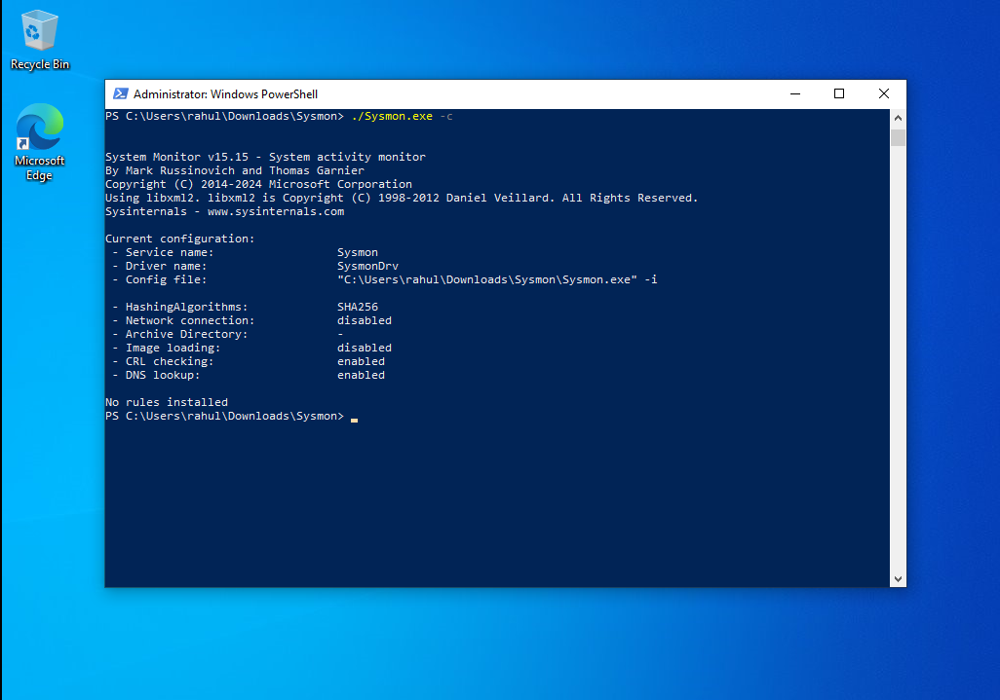

# 💻 Sysmon Installation and Configuration

Sysmon (System Monitor) is a Windows system service and device driver that, once installed, remains resident across system reboots to monitor and log system activity to the Windows event log. It provides detailed information about process creations, network connections, and file creation time changes.

---

## ⬇️ Download Link

* **Download Sysmon:** [Microsoft Sysinternals Sysmon](https://learn.microsoft.com/en-us/sysinternals/downloads/sysmon)

---

## 🚀 Installation

To perform a **default installation** of Sysmon, open an elevated Command Prompt or PowerShell, navigate to the directory where you downloaded the executable, and run the following command.

* **Command:** `./Sysmon -i`
    * `-i` is the flag for installation using the default configuration.
    * `-u` is the flag for uninstall.
    * `-c <config_fileName>` to specify config file .
    


---

## ⚙️ Reviewing Default Configuration

To view the **default configuration** settings that Sysmon is currently using, use the following command. This is useful for confirming what Sysmon is currently monitoring.

* **Command:** `./Sysmon -c`
    * `(-c` is the flag for reviewing the current configuration.)




## ⚙️ Sysmon default log location 

**win+x - > eventvwr.msc**

```
Event Viewer (Local)
 └─ Applications and Services Logs
     └─ Microsoft
         └─ Windows
             └─ Sysmon
                 └─ Operational
```

* ** command:**
    * `Get-WinEvent -LogName "Microsoft-Windows-Sysmon/Operational" | Select-Object -First 5`


